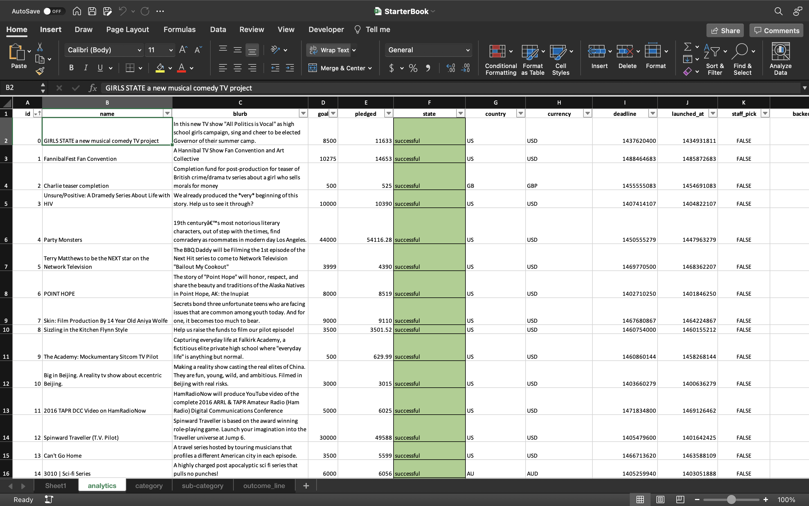
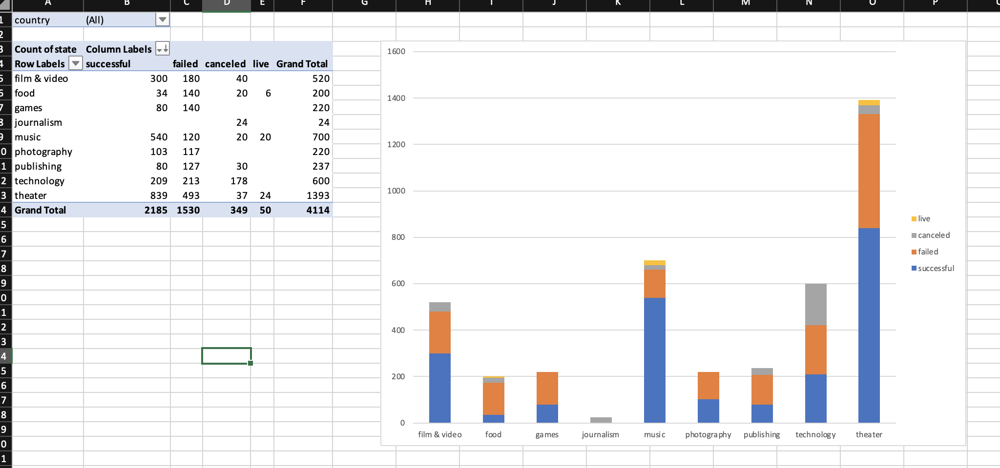
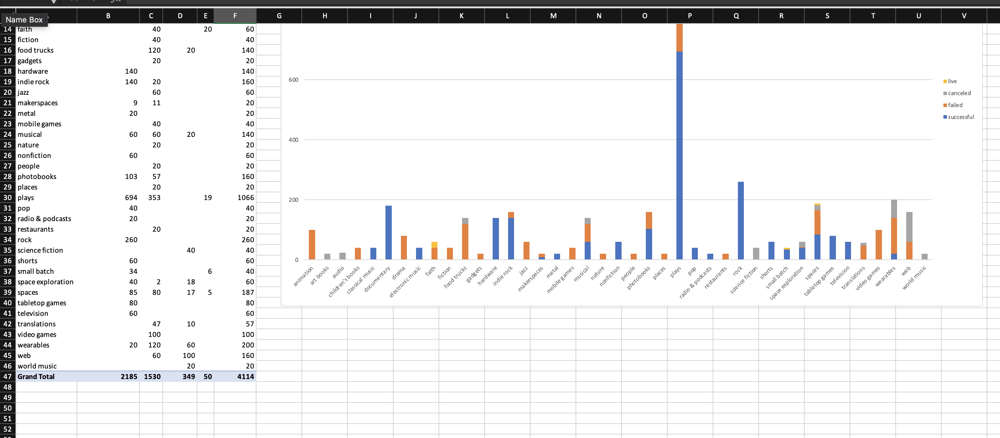
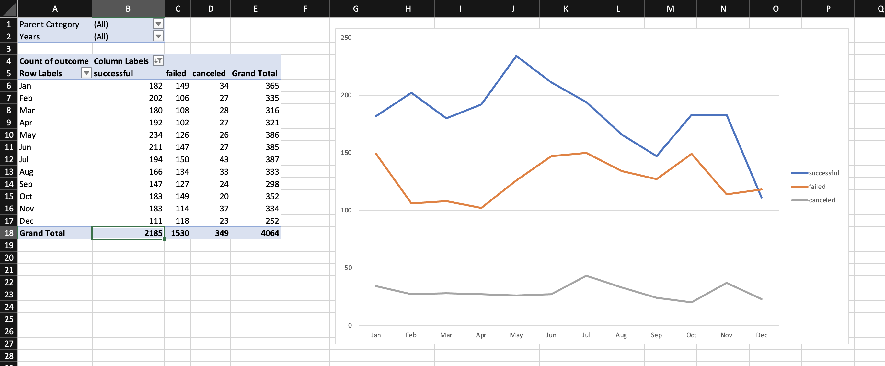

# excel-challenge
### Nothing screams "I'm a professional!" like being able to handle Excel.

For this demonstration of my Excel acumen, I was provided with a spreadsheet with 4,114 Kickstarter campaigns as well as information about them like whether they were successful or not, country of origin, etc. Using nothing but my knowledge and experience using Excel to manipulate and analyze data, I was able to sort through it and make a few observations, which are noted in the spreadsheet and document in this repository.

#### Tools Utilized:
* Excel
* Word

Using the data from the analytics sheet, I was able to create a table and visualize it. This shows the status of all campaigns by category. You can also toggle through countries to see the specific data for that country, however here I have visualized the entire dataset.

Here is another table and visualization, this time looking at subcategories of campaigns.

Here is a visualization and table that shows the rate of success or failure of Kickstarter campaigns by month.

Please feel free to reach out to me with any questions. Have a great one.
